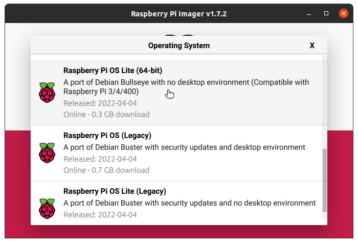
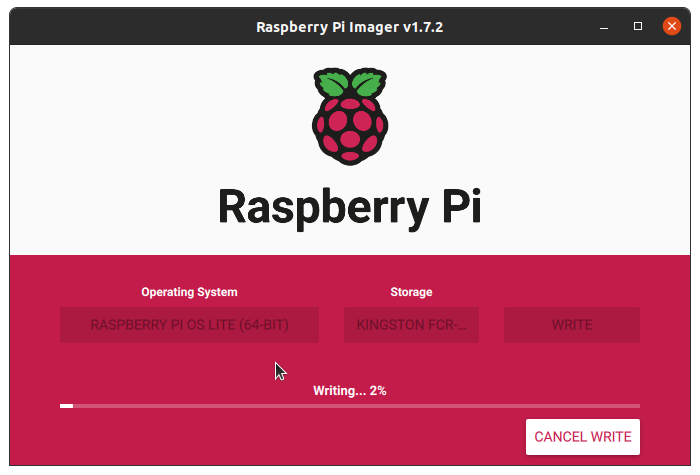

# Setting up Edge server with Raspberry Pi 4B (8GB Ram)

This document covers steps to install Raspberry Pi Lite OS (64bit) using Raspberry foundation provided software tools.  

## Installing OS
1. Install and launch latest version of [Raspberry Pi Imager](https://www.raspberrypi.com/software/)  
   

2. Select the latest version of Raspberry Pi OS lite (64bit).
    > Release date: April 4th 2022  
    > System: 64-bit  
    > Kernel version: 5.15  
    > Debian version: 11 (bullseye)  

    

3. Connect Micro SD card reader with 32GB (or larger) micro SD card, to your computer.

4. Select storage as the micro SD in Raspberry Pi Imager.  
     

5. Click on the gear icon to configure the Advanced Options.  
     
    > Remember to set ***Wireless LAN country*** and ***Locate settings*** (Timezone).

     
   
6. Verify all the options selected and click on ***Write*** button.  
   
    > Select ***yes*** to continue and follow the steps to complete OS installation.  

   
    
7. Eject the Micro SD card and insert into SD card slot of the Raspberry Pi.

8. Setup Raspberry Pi board as documented in the [Getting started](https://www.raspberrypi.com/documentation/computers/getting-started.html#installing-the-operating-system) document. This documentation also shows other methods of installing the OS.
---

