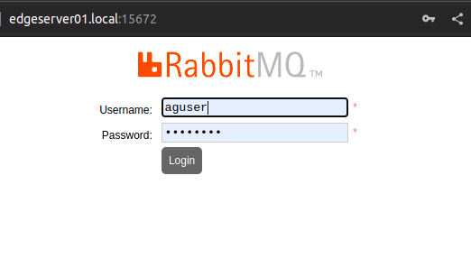

# 1. Collection of projects developed using commodity hardware and opensource software.


# 2. Stage 1. Setting up Edge server with RaspberryPi 4B (8GB Ram)
This document covers steps to install RaspberryPi Lite OS (64bit) using Raspberry foundation provided software tools.  

- [1. Collection of projects developed using commodity hardware and opensource software.](#1-collection-of-projects-developed-using-commodity-hardware-and-opensource-software)
- [2. Stage 1. Setting up Edge server with RaspberryPi 4B (8GB Ram)](#2-stage-1-setting-up-edge-server-with-raspberrypi-4b-8gb-ram)
  - [2.1. Installing Headless OS](#21-installing-headless-os)
  - [2.2. First Boot](#22-first-boot)
  - [<pre>](#pre)


---

## 2.1. Installing Headless OS

**Step 1.** Install the [RaspberryPi Imager](https://www.raspberrypi.com/software/) and launch the application. 
   <details>
   <summary>Fig.1</summary>

      
   </details><br>

**Step 2.** Click on the **CHOOSE OS** button and select the latest version of *RaspberryPi OS lite (64bit)*
   > Release date: April 4th 2022  
   > System: 64-bit  
   > Kernel version: 5.15  
   > Debian version: 11 (bullseye)  

   <details>
   <summary>Fig.2</summary>

     
   </details><br>

**Step 3.** Create new ssh-key pair

```
ssh-keygen -t rsa -b 2048 -f ~/.ssh/pi_key
```
<pre>
<details>  
<summary>ssh-keygen output</summary>
Generating public/private rsa key pair.  
Enter passphrase (empty for no passphrase):  
Enter same passphrase again:   
Your identification has been saved in pi_key  
Your public key has been saved in pi_key.pub  
The key fingerprint is:  
SHA256:jKtSGdXXZUsxXmbkdmPO0XguwleMxANdeVIO3RRmU+I atul@eklavya  
The key's randomart image is:  
+---[RSA 2048]----+  
|       .   ..=X%#|  
|      . . . .*B/*|  
|     .   .    E*@|  
|    .  o   .  +=+|   
|     o. S   o oo.|  
|    o  .     o . |  
|   .  .          |  
|  .  .           |  
|   ..            |  
+----[SHA256]-----+  
</details></pre>

**Step 4.** Connect a Micro SD card reader with 32GB (or larger) micro SD card, to your computer and click on **CHOOSE STORAGE** button to select the micro SD.  
   <details>
   <summary>Fig.3</summary>

     
   </details><br>
   
**Step 5.** Click on the gear icon to configure the Advanced Options.  
Enable **Allow public-key authentication only** option in **Enable SSH** section with the new public key (~/.ssh/pi_key.pub).  
Set the ***Username***, ***SSID with password***, ***Wireless LAN country***, and ***Locate settings*** (Timezone).  
   <details>
   <summary>Fig.4, 5, 6, 7</summary>

     

   

   

     
   </details><br>
   
**Step 6.** Verify all the options selected and click on Write button.  
   <details>
   <summary>Fig. 8, 9</summary>

   
    > Select ***yes*** to continue and follow the steps to complete OS installation.  

   
   </details><br>
    
**Step 7.** Once the writing is completed, insert the Micro SD in the SD card slot of the RaspberryPi and setup RaspberryPi board as documented in the **'Setting up your Raspberry Pi'** section of the ***[Getting started](https://www.raspberrypi.com/documentation/computers/getting-started.html)*** document. This RaspberryPi documentation also includes a video and description of network OS installation! 
<br>

---

## 2.2. First Boot 

First boot may take more than 5-10mins to complete. 

> If a monitor is connected;
> <details>
> <summary>console output may be similar to one below:</summary>
>
> Starting Load/Save RF Kill Switch Status...   
> Started Network Tine Synchronization.  
> [ OK ] Reached target System Initialization.  
> [ OK ] Started Daily Cleanup of Temporary Directories.  
> [ OK ] Reached target System Time Set.  
> [ OK ] Reached target System Time Synchronized.  
> [ OK ] Started Daily apt download activities.  
> [ OK ] Started Daily apt upgrade and clean activities.  
> [ OK ] Started Periodic ext4 Online data Check for A11 Filesystems.  
> [ OK ] Started Discard unused blocks once a week.  
> [ OK ] Started Daily rotation of log files.  
> [ OK ] Started Daily man-db regeneration.  
> [ OK ] Reached target Timers.  
> [ OK ] Listening on Avahi mDNS/DNS-SD Stack Activation Socket.  
> [ OK ] Listening on D-Bus System Message Bus Socket.  
> [ OK ] Listening on triggerhappy.socket.  
> [ OK ] Reached target Sockets.  
> [ OK ] Reached target Basic System.  
>        Starting Save/Restore Sound Card State...  
>        Starting Avahi mDNS/DNS-SD Stack...   
> [ OK ] Started Regular background program processing daemon.  
> [ OK ] Started D-Bus System Message Bus.  
>        Starting dphys-swapfile-init, and delete a swap file...  
>        Starting Remove Stale Online Metadata Check Snapshots...  
>        Starting Configure Bluetooth Modems connected by UART...  
>        Starting LSB: Switch to ondemand cpu governor (unless shift key is pressed)...  
>        Starting Regenerate SSH host keys...  
>        Starting LSB: Resize the root filesystem to fill partition...  
>        Starting LSB: rng-tools (Debian variant)....   
>        Starting Check for RaspberryPi EEPROM updates...  
>        Starting System Logging Service...  
>        Starting User Login Management...  
>        Starting triggerhappy global hotkey daemon...  
>        Starting WPA supplicant...  
> [ OK ] Started Load Save RF Kill Switch Status.  
> [ OK ] Started System Logging Service.  
> [ OK ] Started triggerhappy global hotkey daemon.  
> [ OK ] Finished Save/Restore Sound Card State.  
> [ OK ] Finished Remove Stale Online ext4 Metadata Check Snapshots.  
> [ OK ] Started Avahi mDNS/DNS-SD Stack.  
> [ OK ] Started WPA supplicant.  
> [ OK ] Started User Login Management.  
> [ OK ] Reached target Network.  
> [ OK ] Reached target Sound Card.  
>        Starting DHCP Client Daemon...  
>        Starting /etc/rc.local Compatibility...  
>        Starting Permit User Sessions...   
> [ OK ] Finished Set console font and keymap.  
> [ OK ] Started Configure Bluetooth Modems connected by UART.  
> [ OK ] Started LSB: Switch to ondemand cpu governor (unless shift key is pressed).  
> [ OK ] Started LSB: rng-tools (Debian variant).  
> [ OK ] Finished Check for RaspberryPi EEPROM updates.  
> [ OK ] Finished dphys-swapfile- set up, mount/unmount, and delete a swap file.  
> [ OK ] Finished Regenerate SSH host keys.  
> [ OK ] Started /etc/rc.local Compatibility.  
> [ OK ] Finished Permit User Sessions.  
> [ OK ] Created slice system-bthelper.slice.  
>        Starting RaspberryPi bluetooth helper...  
> [ OK ] Started Getty on tty1.  
> [ OK ] Reached target Login Prompts.  
>        Starting OpenBSD Secure Shell server...  
>        Starting Load Save RF Kill Switch Status...  
> [ OK ] Started Load/Save RF Kill Switch Status.  
> [ OK ] Finished RaspberryPi bluetooth helper.  
>        Starting Bluetooth service...  
> [ OK ] Started OpenBSD Secure Shell server.  
>   
> Debian GNU/Linux 11 edgeserver01 tty1  
>  
> edgeserver01 login: pi (automatic login)  
> 
> Linux edgeserver01 5.15.32-u8 #1538 SMP PREEMPT Thu Mar 31 19:40:39 BST 20ZZ aarch64  
>
> The programs included with the Debian GNU/Linux system are free software: the exact distribution terms for each program are described in the  
>
> individual files in /usr/share/doc/-/copyright.  
>
> Debian GNU/Linux comes with ABSOLUTELY NO WARRANTY, to the extent  
> permitted by applicable law.  
> Last login: Mon Apr 4 07:41:54 PDT 2022 on top  
> pi@edgeserver01:~ $   
> 
</details><br>  

**Step 1.** SSH after first boot

Once the board is ready, thanks to mDNS, IP of RaspberryPi can be found using this command:

```
dig -p 5353  @224.0.0.251 +short edgeserver01.local
```

Login with SSH to RaspberryPi using the Username and Password set in the Advanced options in previous section. [Read more](https://www.raspberrypi.com/news/raspberry-pi-bullseye-update-april-2022/) about recent security updates to Bullseye OS. 

```
ssh  -i ~/.ssh/pi pi@edgeserver01.local
```

**Step 2.** Clone this repository locally

Logout from SSH session. In the this step RaspberryPi OS will be updated to disable Bluetooth, disable console autologin, disable wifi power saving, update apt packages and upgrade OS, install dependencies, install Docker engine, update pi user, and then setup LoRaWAN gateway with RakWireless RAK7371 WisGate Developer Base.
```
git clone https://github.com/Agriculture-IoT/SmartAgriculture.git
cd SmartAgriculture/
tree -L 2
```
After cloning the github repository, content of the directory should be as shown below. 

<pre>
.
├── EdgeServer
│   ├── firstboot
│   ├── influxdb
│   ├── nodered
│   ├── rabbitmq
│   ├── README.md
│   └── vault
├── images
│   ├── Rakwireless
│   └── RaspberryPi
├── LICENSE
├── playbooks
│   ├── edgeserver.yml
│   ├── README.md
│   └── roles
└── README.md
</pre>

**Step 3.** Run ansible playbook
```
cd playbook
ls -alh
cat edgeserver.yml
```

Update the *`ansible_user`* and *`ansible_ssh_private_key_file`* if different values were used while [Installing Headless OS](#21-installing-headless-os) as shown in Fig.5

<pre>
---
- name: edgeserver setup
  hosts: all
  gather_facts: false
  vars:
    ansible_user: pi
    ansible_ssh_private_key_file: ~/.ssh/pi_key
  roles:
    - firstboot
    - base
    - apps
    - chirpstack
  become: true
  become_method: sudo
  environment: 
    DEBIAN_FRONTEND: noninteractive
</pre>

```  
ansible-playbook edgeserver.yml -i edgeserver01.local,    
```

<pre>
<details>  
<summary>Playbook output</summary>
PLAY [edgeserver setup] *********************************************************************************************************************************************************

TASK [base : Ping host] *********************************************************************************************************************************************************
ok: [edgeserver01.local]

TASK [base : Update /etc/dhcpcd.conf] *******************************************************************************************************************************************
changed: [edgeserver01.local]

TASK [base : Disable WiFi power_save] *******************************************************************************************************************************************
changed: [edgeserver01.local]

TASK [base : Update /etc/apt/apt.conf.d/99force-ipv4] ***************************************************************************************************************************
changed: [edgeserver01.local]

TASK [base : Disable bluetooth systemd] *****************************************************************************************************************************************
changed: [edgeserver01.local]

TASK [base : Disable console autologin] *****************************************************************************************************************************************
changed: [edgeserver01.local]

TASK [base : reboot pi] *********************************************************************************************************************************************************
changed: [edgeserver01.local]

TASK [base : Wait for reboot] ***************************************************************************************************************************************************
ok: [edgeserver01.local]

TASK [lorabasics : Ping host] ***************************************************************************************************************************************************
ok: [edgeserver01.local]

TASK [lorabasics : Update apt cache] ********************************************************************************************************************************************
changed: [edgeserver01.local]

TASK [lorabasics : Install required packages for this project] ******************************************************************************************************************
changed: [edgeserver01.local]

TASK [lorabasics : apt upgrade] *************************************************************************************************************************************************
changed: [edgeserver01.local]

TASK [lorabasics : Remove useless packages from the cache] **********************************************************************************************************************
ok: [edgeserver01.local]

TASK [lorabasics : Remove dependencies that are no longer required] *************************************************************************************************************
ok: [edgeserver01.local]

TASK [lorabasics : apt clean] ***************************************************************************************************************************************************
ok: [edgeserver01.local]

TASK [lorabasics : Stop docker services] ****************************************************************************************************************************************
changed: [edgeserver01.local] => (item=docker.service)
changed: [edgeserver01.local] => (item=docker.socket)

TASK [lorabasics : Add docker group to user pi] *********************************************************************************************************************************
changed: [edgeserver01.local]

TASK [lorabasics : Start and Enable docker services] ****************************************************************************************************************************
changed: [edgeserver01.local] => (item=docker.service)
ok: [edgeserver01.local] => (item=docker.socket)

TASK [chirpstack : Ping host] ***************************************************************************************************************************************************
ok: [edgeserver01.local]

TASK [chirpstack : Create directory] ********************************************************************************************************************************************
changed: [edgeserver01.local] => (item=/edgeserver)

TASK [chirpstack : copy files to remote] ****************************************************************************************************************************************
changed: [edgeserver01.local]

TASK [apps : Create rabbitmq logs directory] ************************************************************************************************************************************
changed: [edgeserver01.local]

TASK [apps : start rabbitmq] ****************************************************************************************************************************************************
changed: [edgeserver01.local]

TASK [apps : start influxdb] ****************************************************************************************************************************************************
changed: [edgeserver01.local]

TASK [apps : start nodered] *****************************************************************************************************************************************************
changed: [edgeserver01.local]

TASK [apps : start vault] *******************************************************************************************************************************************************
changed: [edgeserver01.local]

PLAY RECAP **********************************************************************************************************************************************************************
edgeserver01.local         : ok=26   changed=19   unreachable=0    failed=0    skipped=0    rescued=0    ignored=0
</details>    
</pre>

**Step 4.** Login to RabbitMQ 

RabbitMQ management UI is configured to port 15672. Lauch this url in the preferred web browser and use `aguser` and `W3lc0m3!` credentials to login.

> [http://edgeserver01.local:15672/](http://edgeserver01.local:15672/)  
> 