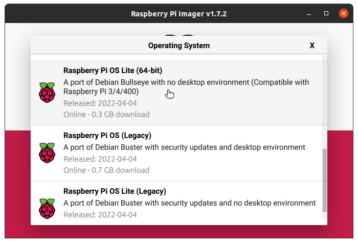
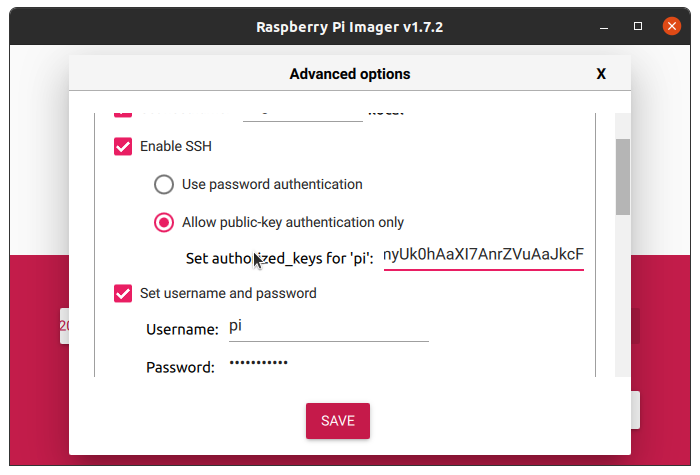
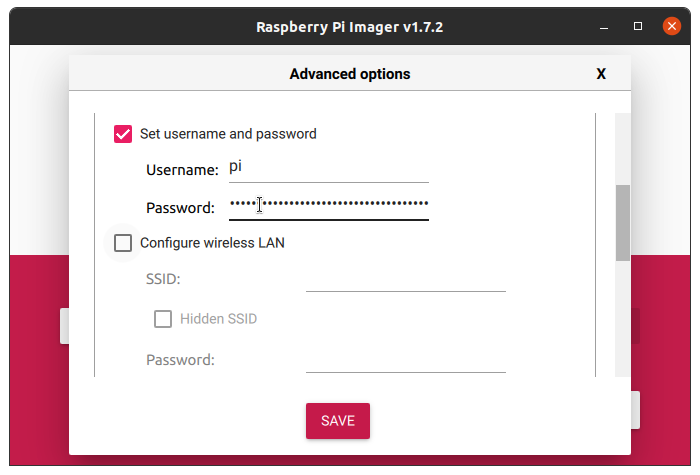
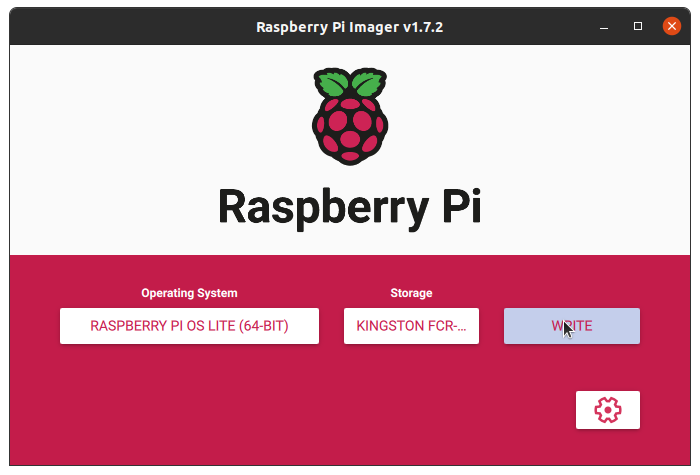
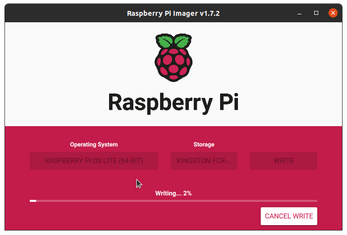

# Collection of projects developed using commodity hardware and opensource software.


# Stage 1. Setting up Edge server with RaspberryPi 4B (8GB Ram)
This document covers steps to install RaspberryPi Lite OS (64bit) using Raspberry foundation provided software tools.  


- [Stage 1. Setting up Edge server with RaspberryPi 4B (8GB Ram)](#stage-1-setting-up-edge-server-with-raspberrypi-4b-8gb-ram)
  - [1. Installing Headless OS](#1-installing-headless-os)
  - [2. First Boot](#2-first-boot)

---

## 1. Installing Headless OS

**Step 1.** Install the [RaspberryPi Imager](https://www.raspberrypi.com/software/) and launch the application. 
   <details>
   <summary>Fig.1</summary>

      
   </details><br>

**Step 2.** Click on the **CHOOSE OS** button and select the latest version of *RaspberryPi OS lite (64bit)*
   > Release date: April 4th 2022  
   > System: 64-bit  
   > Kernel version: 5.15  
   > Debian version: 11 (bullseye)  

   <details>
   <summary>Fig.2</summary>

     
   </details><br>

**Step 3.** Create new ssh-key pair

```
ssh-keygen -t rsa -b 2048 -f ~/.ssh/pi_key
```
<pre>
<details>  
<summary>ssh-keygen output</summary>
Generating public/private rsa key pair.  
Enter passphrase (empty for no passphrase):  
Enter same passphrase again:   
Your identification has been saved in pi_key  
Your public key has been saved in pi_key.pub  
The key fingerprint is:  
SHA256:jKtSGdXXZUsxXmbkdmPO0XguwleMxANdeVIO3RRmU+I atul@eklavya  
The key's randomart image is:  
+---[RSA 2048]----+  
|       .   ..=X%#|  
|      . . . .*B/*|  
|     .   .    E*@|  
|    .  o   .  +=+|   
|     o. S   o oo.|  
|    o  .     o . |  
|   .  .          |  
|  .  .           |  
|   ..            |  
+----[SHA256]-----+  
</details></pre>

**Step 4.** Connect a Micro SD card reader with 32GB (or larger) micro SD card, to your computer and click on **CHOOSE STORAGE** button to select the micro SD.  
   <details>
   <summary>Fig.3</summary>

     
   </details><br>
   
**Step 5.** Click on the gear icon to configure the Advanced Options.  
Enable **Allow public-key authentication only** option in **Enable SSH** section with the new public key (~/.ssh/pi_key.pub).  
Set the ***Username***, ***SSID with password***, ***Wireless LAN country***, and ***Locate settings*** (Timezone).  
   <details>
   <summary>Fig.4, 5, 6, 7</summary>

     

   

   

     
   </details><br>
   
**Step 6.** Verify all the options selected and click on Write button.  
   <details>
   <summary>Fig. 8, 9</summary>

   
    > Select ***yes*** to continue and follow the steps to complete OS installation.  

   
   </details><br>
    
**Step 7.** Once the writing is completed, insert the Micro SD in the SD card slot of the RaspberryPi and setup RaspberryPi board as documented in the **'Setting up your Raspberry Pi'** section of the ***[Getting started](https://www.raspberrypi.com/documentation/computers/getting-started.html)*** document. This RaspberryPi documentation also includes a video and description of network OS installation! 
<br>

---

## 2. First Boot 

First boot may take more than 5-10mins to complete. 

> If a monitor is connected;
> <details>
> <summary>console output may be similar to one below:</summary>
>
> Starting Load/Save RF Kill Switch Status...   
> Started Network Tine Synchronization.  
> [ OK ] Reached target System Initialization.  
> [ OK ] Started Daily Cleanup of Temporary Directories.  
> [ OK ] Reached target System Time Set.  
> [ OK ] Reached target System Time Synchronized.  
> [ OK ] Started Daily apt download activities.  
> [ OK ] Started Daily apt upgrade and clean activities.  
> [ OK ] Started Periodic ext4 Online data Check for A11 Filesystems.  
> [ OK ] Started Discard unused blocks once a week.  
> [ OK ] Started Daily rotation of log files.  
> [ OK ] Started Daily man-db regeneration.  
> [ OK ] Reached target Timers.  
> [ OK ] Listening on Avahi mDNS/DNS-SD Stack Activation Socket.  
> [ OK ] Listening on D-Bus System Message Bus Socket.  
> [ OK ] Listening on triggerhappy.socket.  
> [ OK ] Reached target Sockets.  
> [ OK ] Reached target Basic System.  
>        Starting Save/Restore Sound Card State...  
>        Starting Avahi mDNS/DNS-SD Stack...   
> [ OK ] Started Regular background program processing daemon.  
> [ OK ] Started D-Bus System Message Bus.  
>        Starting dphys-swapfile-init, and delete a swap file...  
>        Starting Remove Stale Online Metadata Check Snapshots...  
>        Starting Configure Bluetooth Modems connected by UART...  
>        Starting LSB: Switch to ondemand cpu governor (unless shift key is pressed)...  
>        Starting Regenerate SSH host keys...  
>        Starting LSB: Resize the root filesystem to fill partition...  
>        Starting LSB: rng-tools (Debian variant)....   
>        Starting Check for RaspberryPi EEPROM updates...  
>        Starting System Logging Service...  
>        Starting User Login Management...  
>        Starting triggerhappy global hotkey daemon...  
>        Starting WPA supplicant...  
> [ OK ] Started Load Save RF Kill Switch Status.  
> [ OK ] Started System Logging Service.  
> [ OK ] Started triggerhappy global hotkey daemon.  
> [ OK ] Finished Save/Restore Sound Card State.  
> [ OK ] Finished Remove Stale Online ext4 Metadata Check Snapshots.  
> [ OK ] Started Avahi mDNS/DNS-SD Stack.  
> [ OK ] Started WPA supplicant.  
> [ OK ] Started User Login Management.  
> [ OK ] Reached target Network.  
> [ OK ] Reached target Sound Card.  
>        Starting DHCP Client Daemon...  
>        Starting /etc/rc.local Compatibility...  
>        Starting Permit User Sessions...   
> [ OK ] Finished Set console font and keymap.  
> [ OK ] Started Configure Bluetooth Modems connected by UART.  
> [ OK ] Started LSB: Switch to ondemand cpu governor (unless shift key is pressed).  
> [ OK ] Started LSB: rng-tools (Debian variant).  
> [ OK ] Finished Check for RaspberryPi EEPROM updates.  
> [ OK ] Finished dphys-swapfile- set up, mount/unmount, and delete a swap file.  
> [ OK ] Finished Regenerate SSH host keys.  
> [ OK ] Started /etc/rc.local Compatibility.  
> [ OK ] Finished Permit User Sessions.  
> [ OK ] Created slice system-bthelper.slice.  
>        Starting RaspberryPi bluetooth helper...  
> [ OK ] Started Getty on tty1.  
> [ OK ] Reached target Login Prompts.  
>        Starting OpenBSD Secure Shell server...  
>        Starting Load Save RF Kill Switch Status...  
> [ OK ] Started Load/Save RF Kill Switch Status.  
> [ OK ] Finished RaspberryPi bluetooth helper.  
>        Starting Bluetooth service...  
> [ OK ] Started OpenBSD Secure Shell server.  
>   
> Debian GNU/Linux 11 edgeserver01 tty1  
>  
> edgeserver01 login: pi (automatic login)  
> 
> Linux edgeserver01 5.15.32-u8 #1538 SMP PREEMPT Thu Mar 31 19:40:39 BST 20ZZ aarch64  
>
> The programs included with the Debian GNU/Linux system are free software: the exact distribution terms for each program are described in the  
>
> individual files in /usr/share/doc/-/copyright.  
>
> Debian GNU/Linux comes with ABSOLUTELY NO WARRANTY, to the extent  
> permitted by applicable law.  
> Last login: Mon Apr 4 07:41:54 PDT 2022 on top  
> pi@edgeserver01:~ $   
> 
</details><br>  

**Step 1.** After the first boot, thanks to mDNS, IP can be found using this command:

```
dig -p 5353  @224.0.0.251 +short edgeserver01.local
```
Login with SSH to RaspberryPi using the Username and Password set in the Advanced options in previous section. [Read more](https://www.raspberrypi.com/news/raspberry-pi-bullseye-update-april-2022/) about recent security updates to Bullseye OS. 

```
ssh pi@edgeserver01.local
```

**Step 2.** Update network interfaces metrics in */etc/dhcpcd.conf* of RaspberryPi:

```
printf "interface wlan0
metric 0

interface wwan0
metric 0\n"| sudo tee -a /etc/dhcpcd.conf
```

**Step 3.** Disable WiFi power_save, MTP probe and Bluetooth:

```
sudo sed -i '/exit\ 0/i \
iw wlan0 set power_save off \
iw dev wlan0 set power_save off \
export MTP_NO_PROBE="1" \
' /etc/rc.local

sudo systemctl stop bluetooth.service bluetooth.target
sudo systemctl disable bluetooth.service

sudo reboot
```

**Step 4.** After the reboot, SSH login again to RaspberryPi and then run these commands:
```
sudo bash -c 'printf "Acquire::ForceIPv4 \"true\";" > /etc/apt/apt.conf.d/99force-ipv4'

export DEBIAN_FRONTEND=noninteractive

sudo DEBIAN_FRONTEND=noninteractive apt update -y
sudo DEBIAN_FRONTEND=noninteractive apt upgrade -y

sudo DEBIAN_FRONTEND=noninteractive apt install -y build-essential 
sudo DEBIAN_FRONTEND=noninteractive apt install -y python3 python3-pip
sudo DEBIAN_FRONTEND=noninteractive apt install -y cmake libudev-dev
sudo DEBIAN_FRONTEND=noninteractive apt install -y libusb-1.0-0-dev libffi-dev
sudo DEBIAN_FRONTEND=noninteractive apt install -y libssl-dev git
sudo DEBIAN_FRONTEND=noninteractive apt install -y minicom socat
sudo DEBIAN_FRONTEND=noninteractive apt install -y libqmi-utils udhcpc mtr gnutls-bin
sudo DEBIAN_FRONTEND=noninteractive apt install -y p7zip-full i2c-tools gpsd
sudo DEBIAN_FRONTEND=noninteractive apt install -y mlocate vim 
sudo DEBIAN_FRONTEND=noninteractive apt install -y docker
sudo DEBIAN_FRONTEND=noninteractive apt install -y docker-compose

sudo systemctl stop docker.service docker.socket
sudo usermod -aG docker pi

sudo systemctl start docker.service docker.socket
sudo systemctl enable docker.service docker.socket
```

**Step 5.** Create a python3 environment
```
sudo mkdir /edgeserver
sudo chown -R pi:pi /edgeserver

python3 -m pip install virtualenv
python3 -m virtualenv /edgeserver/.venv
source /edgeserver/.venv/bin/activate
pip install --upgrade pip
pip install --upgrade setuptools
export CFLAGS=-fcommon
pip install RPi.GPIO
```

**Step 6.** Disable auto-login using **sudo raspi-config** and then restart RaspberryPi.

> Optional Step: Configure key based authentication for SSH.

---

